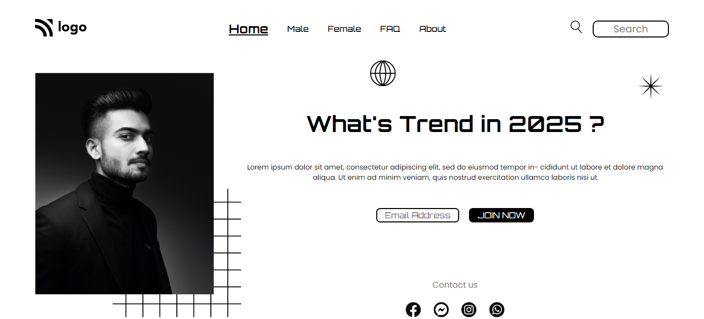

# Website Landing Page

## Hi everyone, I am **Raushan Kumar**.

This was the first landing page I coded in pure CSS. I was able to learn: 
  - CSS Positions
  - CSS Flexbox
  - Margin and Padding applications
  - Z-index

> **CSS Positons** was the real challenge to learn because of its different values like static, relative, absolute and fixed but this landing page helped me implement and understand all the properties in a descriptive manner😎.

> **Flexbox** really helped in coding the navbar and footer. A simple `display: flex;` can do the job pretty well with other properties💪.

> **Z-index** helped in proper stacking of the meshgrid and the image. Also, deeply understood how is stacking done and the role of Z-index properly.

**Challenges** 👉 There were many challenges involved in this project, might be because this was first of the kind of project I was building, like dealing with the navbar and especially the proper positioning of the image and the meshgrid. CSS Positions and Z-index helped me out here, even Position came to help when I was stuck in positioning the globe png and star png images. Flexbox helped me out in dealing with the navbar but I think as a beginner project I should have avoid using that and used only Positions. Nevertheless, I already have used Positions quite a lot in the project so using Flexbox was not a big issue. The motive was majorly to clear the concepts of positions in css and it was achieved.

>**This project took me 7 hours to complete that involved learning about CSS Positions, Z-index and tiny bit of Flexbox**😃

Below is what I built👇

